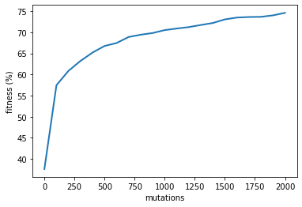
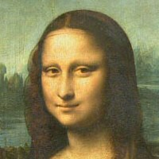
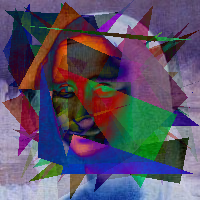

# Evolutionary Algorithms Painting
### Author: Virendrasinh Chavda
This repository showcases the use of <strong>evolutionary algorithms</strong> to generate abstract paintings by approximating a target image. The project demonstrates the capability of algorithms inspired by natural selection to optimize artistic approximations through iterative improvements in fitness.

---

## Table of Contents
1. [Overview](#overview)
2. [Installation](#installation)
3. [Features](#features)
4. [Usage](#usage)
5. [Methodology](#methodology)
6. [Results](#results)
7. [Future Work](#future-work)
8. [Contributing](#contributing)
9. [License](#license)

---

## Overview

<p align="justify">
This project uses evolutionary algorithms to create paintings by combining simple shapes like triangles. The program evolves an abstract representation of an input image, such as the Mona Lisa, through iterations guided by a fitness function. Over time, the generated painting increasingly resembles the target image. Key concepts such as mutations, crossover, and selection are applied to improve the population of shapes.
</p>

---

## Installation

To set up and run this project, follow these steps:

1. Clone the repository:
   ```bash
   git clone https://github.com/your-repo/evolutionary-painting.git
   cd evolutionary-painting
   ```
2. Create a virtual environment:
   ```bash
   python -m venv env
   source env/bin/activate  # On Windows: env\Scripts\activate
   ```
3. Install the required dependencies:
   ```bash
   pip install -r requirements.txt
   ```
4. Launch the Jupyter Notebook:
   ```bash
   jupyter notebook
   ```

## Features

### Evolutionary Painting
- Generate abstract paintings by combining simple shapes like triangles.
- Use a fitness function to compare the generated image with the target image.

### Fitness Plotting
- Visualize the improvement in fitness over generations.
- Monitor how the painting evolves to match the target.

### Customization
- Change the target image.
- Adjust parameters like population size, mutation rate, and the number of triangles.

---

## Usage

### Run the Algorithm
- Open the `Evolutionary_algorithms_painting.ipynb` notebook.
- Set the target image (e.g., `img1.png`) and parameters like mutation rate and population size.

### Track Fitness
- Observe the fitness graph to track how the algorithm improves the painting over generations.

### View Results
- Check intermediate and final approximations of the painting.

### Customize Settings
- Change the target image or experiment with different parameters to see how the results change.

---

## Methodology

### Steps

#### Initialization
- Generate a random population of triangles as the initial painting.

#### Fitness Evaluation
- Compare the generated image with the target image using a fitness function (e.g., pixel-wise similarity).

#### Selection
- Select the best-performing individuals (paintings) for reproduction.

#### Crossover and Mutation
- Combine individuals to create new ones and introduce mutations (e.g., adjust triangle positions, colors, or sizes).

#### Iteration
- Repeat the process for a specified number of generations, refining the painting with each step.

---

### Tools Used
- <strong>NumPy</strong>: For numerical computations.
- <strong>Matplotlib</strong>: To visualize the fitness graph and generated paintings.
- <strong>Pillow</strong>: For image processing.

---

## Results

### Fitness Improvement
The fitness graph below demonstrates how the generated painting increasingly matches the target image over generations:



### Example Images
1. <strong>Target Image</strong>: Mona Lisa  
   

2. <strong>Generated Approximation</strong>:  
   

The algorithm starts with random triangles and iteratively evolves to approximate the target image.

---

## Future Work

### Enhanced Shapes
- Introduce more complex shapes like circles or polygons for better approximations.

### Dynamic Parameters
- Allow mutation rates or population sizes to change dynamically during evolution.

### Performance Optimization
- Improve the algorithm's efficiency for high-resolution target images.

### Interactive Interface
- Develop a web-based interface where users can upload their own target images and see results in real-time.

---

## Contributing

Contributions are welcome! Feel free to fork the repository, make improvements, and submit a pull request. If you encounter any issues, open a GitHub issue for discussion.

---

## License

This project is licensed under the MIT License. See the [LICENSE](./LICENSE) file for more details.
